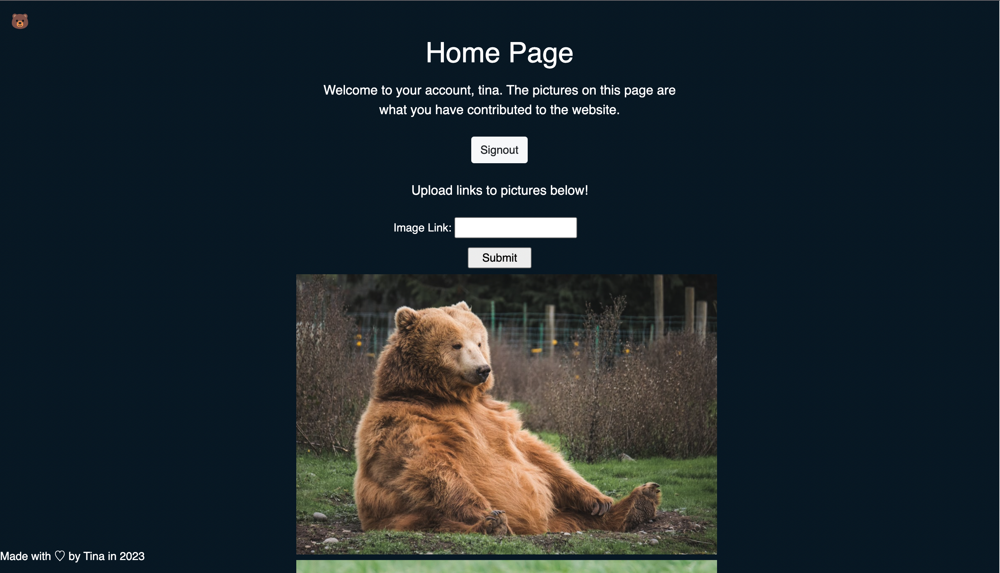
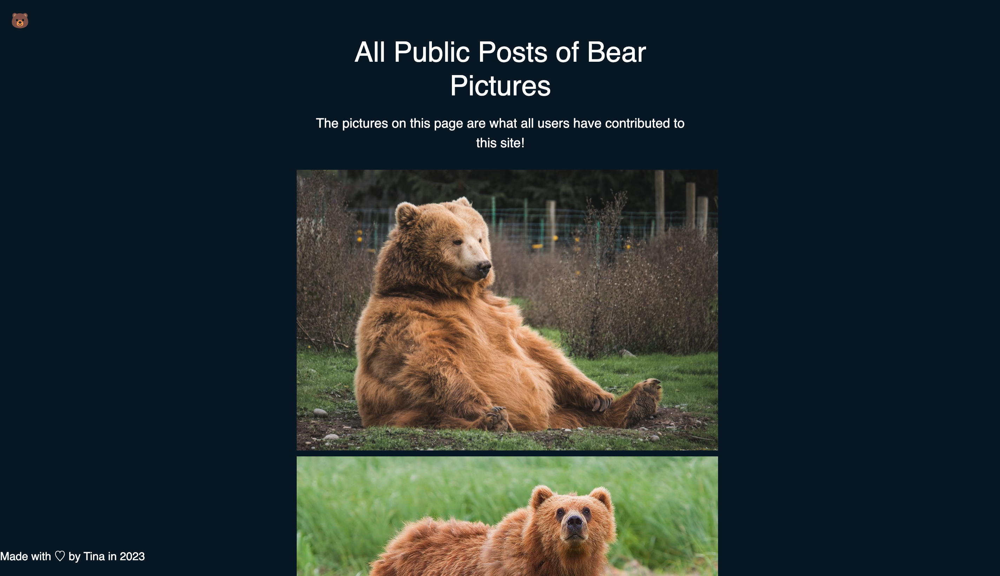

# gm-flask-mongodb-project

This is a website for users to post bear pictures. Meant to demonstrate understanding of Flask and MongoDB. Website is deployed at https://gm-flask-mongodb-project.herokuapp.com/.

## Development Environment

From `gm-flask-mongodb-project` directory, run `python3 -m virtualenv venv` - creates virtual environment

`source venv/bin/activate` to start virtual enviroment

`deactivate` to deactivate environment

`pip3 install -r requirements.txt` - install requirements.txt

`pip freeze > requirements.txt` - update requirements.txt

To run and test Flask application, run `flask run` in `gm-flask-mongodb-project` directory and paste link into browser

## Screenshots

 
 

